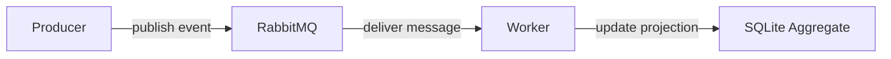

# PHP Event Pipeline Reference

Minimal asynchronous event pipeline in PHP using RabbitMQ and a background worker.

Demonstrates how to move work out of the request lifecycle and process domain events asynchronously.

# What This Shows

- explicit system boundaries without framework abstraction
- asynchronous processing in PHP
- message-based system design
- worker-based execution model
- projection-based persistence

---

# Quick Start

Run the full end-to-end flow:

```bash
make smoke
```

This will:

- start RabbitMQ and worker
- publish a valid event
- process it asynchronously
- verify aggregate state
- publish an invalid event

---

# What to Look At

Key entry points in the codebase:

- `app/cli.php` — composition root (manual wiring, no framework)
- `app/Console/WorkerCommand.php` — async worker loop
- `app/Broker/RabbitMqPublisher.php` — message publishing
- `app/Broker/RabbitMqConnectionFactory.php` — AMQP connection handling
- `app/Event/*` — event definition and validation
- `app/Persistence/ActivityAggregateStore.php` — projection logic (read model)
- `app/Persistence/ActivityAggregateSchema.php` — SQLite schema

Smoke test (end-to-end flow):

- `Makefile: smoke` — producer → broker → worker → projection

---

# Architecture



Detailed explanation: `docs/architecture.md`

Architectural decisions: `docs/decisions.md`

Flow:

1. Producer publishes event
2. RabbitMQ transports message
3. Worker consumes and processes event
4. Projection is updated in SQLite

---

# Developer Workflow

Start environment:

```bash
make up
```

Run worker:

```bash
make worker
```

Publish event:

```bash
make produce
```

Inspect aggregate:

```bash
make inspect
```

Run full flow:

```bash
make smoke
```

Quality checks:

```bash
make qa
```

---

# Testing

Run tests:

```bash
make test
```

Tests validate:

- aggregate behavior
- deterministic updates
- correct event processing logic

---

# Tech Stack

- PHP 8
- RabbitMQ
- SQLite
- Docker
- Makefile
- PHPStan

---

# Scope

This repository intentionally does NOT include:

- retry strategies
- dead letter queues
- idempotency handling
- ordering guarantees
- distributed tracing

The focus is strictly on the core asynchronous event pipeline.
