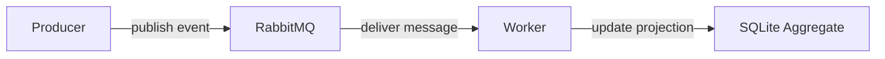

# Architecture

## Sections

- [Overview](#overview)
- [Flow diagram](#flow-diagram)
- [Mapping to implementation](#mapping-to-implementation)
- [Execution flow](#execution-flow-mapped-to-code)
- [Component responsibilities](#component-responsibilities)
- [System boundaries](#system-boundaries)
- [Delivery model](#delivery-model)
- [Data flow](#data-flow)
- [Limitations](#limitations-of-this-reference-implementation)
- [Possible extensions](#possible-extensions)

## Overview

This repository implements a minimal asynchronous event pipeline in PHP.

High-level flow:

producer -> broker -> worker -> aggregate store

A producer publishes a domain event, RabbitMQ transports it, a worker consumes and processes it, and the result is written into a SQLite aggregate for inspection.

---

## Flow diagram

## Mapping to implementation

The diagram above directly maps to the code structure in this repository:

- **Producer**
    - `app/Console/PublishDemoEvent.php`
    - Entry point for publishing domain events

- **Broker (RabbitMQ)**
    - `app/Broker/RabbitMqPublisher.php`
    - `app/Broker/RabbitMqConnectionFactory.php`
    - Responsible for transporting messages

- **Worker**
    - `app/Console/WorkerCommand.php`
    - Consumes messages from RabbitMQ, validates the event payload, and applies the event to the aggregate store.

- **Event / Domain**
    - `app/Event/*`
    - Defines event structure and validation

- **Processing**
    - implemented inside `WorkerCommand`
    - responsible for:
        - deserialization
        - validation
        - applying event to aggregate

- **Aggregate store (SQLite)**
    - `app/Persistence/ActivityAggregateStore.php`
    - `app/Persistence/ActivityAggregateSchema.php`
    - Stores observable state

- **Inspection**
    - `app/Console/InspectAggregate.php`
    - Reads and prints aggregate state

## Execution flow (mapped to code)

1. `PublishDemoEvent` publishes an event via `RabbitMqPublisher`
2. RabbitMQ receives and transports the message
3. `WorkerCommand` consumes the message asynchronously
4. Worker processes the event (deserializes and validates the event payload) and updates `ActivityAggregateStore`
5. `InspectAggregate` reads the resulting state

---

## Component responsibilities

### Producer
Responsible for creating and publishing an event payload.

### Broker
RabbitMQ acts as the transport layer between producer and worker.

### Worker
Responsible for consuming messages, validating payloads, and applying the event to the projection.

### Aggregate store
SQLite stores the observable projection of processed events.

---

## System boundaries

The system is split into clear boundaries:

- Producer: responsible only for publishing events
- Broker: responsible only for transport
- Worker: responsible for processing
- Persistence: responsible for storing projections

Each component is isolated and communicates only through well-defined interfaces.

---

## Why this architecture

The purpose of this design is to move secondary work out of the original request lifecycle and make processing asynchronous.

This keeps the example focused on:

- explicit boundaries
- asynchronous flow
- observable results

---

## Delivery model

The system follows an at-least-once delivery model.

This means:
- messages can be delivered more than once
- no exactly-once guarantees are provided
- processing should be idempotent in real systems

Idempotency is intentionally not implemented in this repository to keep the example minimal.

---

## Data flow

The event payload is serialized by the producer, transported as a message via RabbitMQ, and deserialized by the worker before processing.

The resulting state is persisted in SQLite as a projection, not as an event log.

---

## Limitations of this reference implementation

- no retry strategy is implemented
- failed messages are not routed to a dead-letter queue
- connection recovery is not handled
- processing is not idempotent
- no ordering guarantees are provided

These concerns are intentionally omitted to keep the example focused on the core event pipeline flow.

---

## Possible extensions

- retry strategy
- dead-letter queue handling
- idempotent processing
- reconnect handling
- metrics and structured logging
